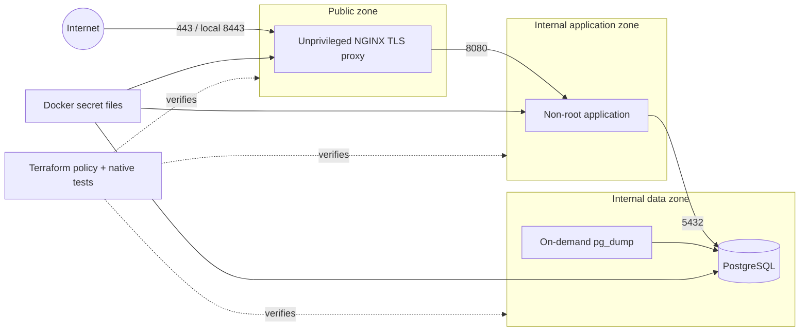

# CloudForge Reference Architecture

**Cloud · Infrastructure · DevOps · Security**

CloudForge is a locally testable Infrastructure-as-Code reference for separating an internet-facing application into public, application, and data trust zones without provisioning paid cloud resources.

## Problem

A prototype often becomes one internet-facing VM containing the reverse proxy, application, database, secrets, and backups. It works, but a single exposed process or permissive firewall can reach everything. Recovery is undocumented, health is ambiguous, and configuration drifts between environments.

## Who This Helps

Developers, platform engineers, small teams, and reviewers learning to turn a working application into reproducible infrastructure with explicit boundaries and operational evidence.

## Why It Matters

Network segmentation limits blast radius. Health probes distinguish a live process from a ready service. Immutable configuration reduces drift. Secret files reduce accidental environment/log exposure. Tested backups determine whether recovery is real rather than assumed.

## Constraints

The architecture must remain inspectable without a cloud account, avoid paid resources, express cloud-portable policy rather than pretend local containers are a production cloud, and require operators to supply their own uncommitted secrets and TLS material.

## Solution

Terraform models trust zones, allowed ingress, explicit denied paths, environment separation, and service security baselines. Docker Compose proves the topology locally: only an unprivileged TLS reverse proxy publishes a host port; the proxy reaches the application network; only the application bridges to the internal data network; PostgreSQL publishes nothing. Health, structured logs, secret files, backups, smoke tests, and recovery guidance complete the operational path.

## Architecture



See [architecture](docs/architecture.md), [deployment](docs/deployment.md), [security](docs/security.md), and [threat model](docs/threat-model.md).

## Implemented Features

- Provider-independent Terraform trust-zone and ingress policy modules.
- Unique-CIDR, environment, and management-source validation.
- Explicit allow paths and reviewable deny-path documentation.
- Service baseline policy checking non-root, read-only, healthcheck, and data-port rules.
- Native `terraform test` assertions.
- Separate local, development, and production roots with example variables.
- Unprivileged NGINX TLS termination with TLS 1.2/1.3 and defensive headers.
- Public/application/data Docker networks; application and data networks are internal.
- Only the proxy publishes a loopback-bound host port.
- Non-root application with liveness/readiness, request IDs, graceful draining, and JSON logs.
- PostgreSQL health checks, durable data volume, and secret-file password injection.
- On-demand operations-profile `pg_dump` backup with a restrictive umask.
- Bootstrap, validation, backup, and end-to-end smoke-test scripts.
- Automated topology and hardening tests.

## Technology Stack

Terraform expresses reviewable intent and testable policy without a provider or bill. Docker Compose supplies a local runtime proof. NGINX provides TLS and the public boundary. A small standard-library Python service makes readiness, liveness, forwarding, and shutdown visible without distracting application dependencies. PostgreSQL represents a private stateful layer. Pytest and PyYAML validate the composed topology.

## Setup

Requirements: Terraform 1.6+, Docker Compose, Python 3.11+, OpenSSL, and curl.

```bash
python -m venv .venv
. .venv/bin/activate
pip install -e '.[dev]'
./scripts/bootstrap-local.sh
./scripts/validate.sh
```

## Usage

```bash
docker compose up --build -d
./scripts/smoke-test.sh
curl --insecure https://127.0.0.1:8443/
./scripts/backup.sh
docker compose down
```

Inspect policy without creating resources:

```bash
terraform -chdir=terraform/environments/local init -backend=false
terraform -chdir=terraform/environments/local plan
terraform -chdir=terraform test
```

## Testing

```bash
terraform fmt -check -recursive terraform
terraform -chdir=terraform/environments/local validate
terraform -chdir=terraform test
docker compose config --quiet
pytest -q
```

Tests prove exclusive port publication, exact network membership, internal networks, runtime hardening, health checks, secret-file use, TLS policy, explicit denies, native Terraform assertions, fail-fast scripts, and backup wiring.

## Security

`.secrets/` is ignored and generated with mode 600. Local self-signed TLS exists only to prove termination; production needs an automated trusted certificate lifecycle. Keep PostgreSQL private, use distinct credentials per environment, restrict management CIDRs, scan images, pin reviewed digests, export logs, encrypt/verify backups, and implement a cloud firewall from the Terraform policy outputs.

## Limitations

- Terraform models policy but intentionally provisions no cloud VPC, load balancer, firewall, database, DNS, or paid resource.
- Compose network isolation is a local proof, not a substitute for cloud security groups, network ACLs, Kubernetes policy, or host firewalling.
- The demo application does not query PostgreSQL; the topology proves reachability boundaries rather than business behavior.
- Self-signed local TLS is not suitable for users.
- The backup command creates a dump; operators must implement encryption, off-host retention, restore drills, and expiry.
- No autoscaling, multi-region failover, managed identity, WAF, or compliance claim.

## Contributing

Read [CONTRIBUTING.md](CONTRIBUTING.md). Infrastructure changes must update policy assertions, topology tests, diagrams, deployment steps, and rollback considerations together.
