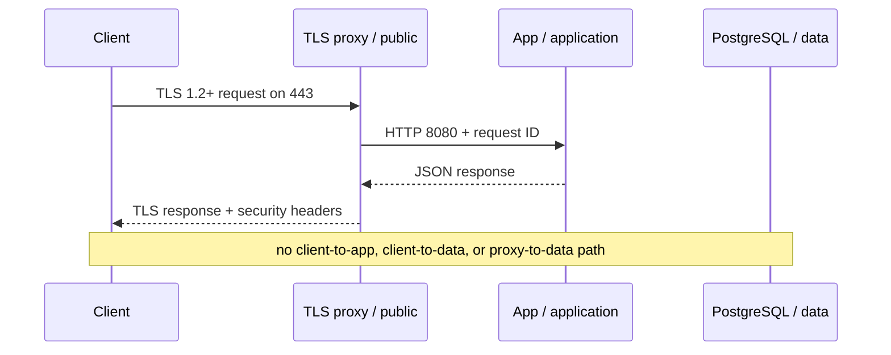

# CloudForge Architecture

## Trust zones

The public zone contains only the TLS proxy. The internal application zone carries proxy-to-app traffic. The internal data zone carries app-to-PostgreSQL and backup traffic. The proxy never joins data; PostgreSQL never joins public or application; only the application bridges application and data. This makes the required communication path visible instead of relying on naming conventions.

## Policy and runtime

Terraform is the design contract. It validates distinct CIDRs, known environments, explicit management CIDRs, allowed ports, denied paths, and service hardening. Compose is the executable local proof. The two representations are tested independently so a topology edit cannot silently become policy.

## Availability and lifecycle

Proxy health confirms TLS listener operation. Application liveness proves the process loop, while readiness can become false during graceful drain. PostgreSQL uses `pg_isready`. Compose starts dependencies based on health. SIGTERM changes readiness before shutdown so an external orchestrator can stop routing requests.

## Secrets and state

Database password, TLS certificate/key, and pgpass are file-mounted secrets rather than literal Compose values. PostgreSQL data and backup dumps use separate named volumes. Application roots are read-only with temporary filesystems only where required. Local bootstrap creates ignored, mode-600 material; production must use a managed secret and certificate system.
